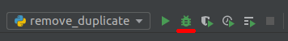
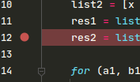
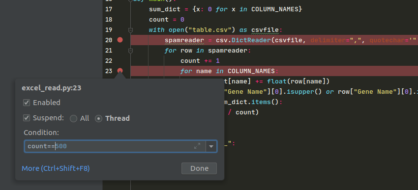
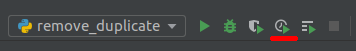
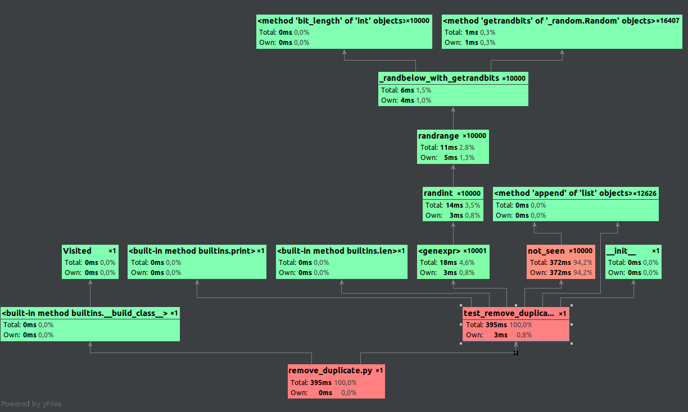
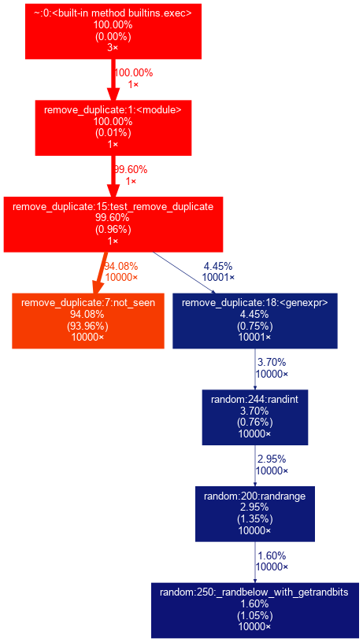

*************************
The Debugger and Profiler
*************************

The Debugger
============

Introduction
++++++++++++++++++
*There should exist a better method for finding errors than "print"*

The debugger allows you to inspect code when the program encounters an unhandled error or at user-defined breakpoints.

To run code under debugger in Pycharm use the bug icon:

To set a breakpoint right-click on a line number:

To remove it, click on it again.

You can also set conditional breakpoints.
To do this create a normal breakpoint and right-click on it. 
A popup will appear in which you can type a condition.

Exercises
+++++++++

Exercise 1
~~~~~~~~~~
Debug the following code ``code/other_debugger/mutable_example.py``

Exercise 2
~~~~~~~~~~
Debug the following code ``code/other_debugger/problematic_zip.py``

Exercise 3
~~~~~~~~~~
Debug the following code ``code/files_problem/high_temperature_change.py``

Exercise 4
~~~~~~~~~~
Debug the following code ``code/excel_date_problem/excel_read.py``

Debugging from the terminal
++++++++++++++++++++++++++

The primary debugger for python is ``pdb`` [#pdb]_.
It can be used as a library (which needs code modification) [#pdb_library]_
To run a script under the debugger use the command ``python -m pdb /path/to/script``.
Here is an example of a debug session for ``mutable_example.py``.

.. code-block::

    $ python -m pdb other_debugger/mutable_example.py
    > /.../python-tools/debugger/code/other_debugger/mutable_example.py(1)<module>()
    -> def create_list(a, b, initial=[]):
    (Pdb) break 9
    Breakpoint 1 at /.../python-tools/debugger/code/other_debugger/mutable_example.py:9
    (Pdb) continue
    > /.../python-tools/debugger/code/other_debugger/mutable_example.py(9)main()
    -> assert len(create_list(1, 2)) == 2
    (Pdb) step
    --Call--
    > /.../python-tools/debugger/code/other_debugger/mutable_example.py(1)create_list()
    -> def create_list(a, b, initial=[]):
    (Pdb) step
    > /.../python-tools/debugger/code/other_debugger/mutable_example.py(2)create_list()
    -> initial.extend([a, b])
    (Pdb) p initial
    [1, 2]

A list of commands and corresponding shortcuts is available here:
https://docs.python.org/3/library/pdb.html#debugger-commands

Usage of the Python debugger from the terminal is similar to other common debuggers, like ``gdb``, ``lldb`` etc.

Profiler
========
*Instead of guessing where your code bottlenecks, just check it!*

In this task we will use the following example: ``code/profiler_example/remove_duplicate.py``

.. include:: code/profiler_example/remove_duplicate.py
   :code: python

cProfiler
+++++++++
https://docs.python.org/3/library/profile.html

cProfiler is the default built-in profiler which counts and measures calls of functions.
Thus it allows you to check which function which code block has a long execution time.
In PyCharm profiler support is integrated only in the Professional version [#pycharm_info]_.
To use it, create an execution profile by clicking the profile button

Alternatively it can be run from the command line to produce a table with information on which function takes the most time:

.. code-block::

    $  python -m cProfile -s tottime remove_duplicate.py
    found 6342 unique elements
             90442 function calls (90415 primitive calls) in 0.396 seconds

       Ordered by: internal time

       ncalls  tottime  percall  cumtime  percall filename:lineno(function)
        10000    0.372    0.000    0.372    0.000 remove_duplicate.py:7(not_seen)
        10000    0.006    0.000    0.012    0.000 random.py:200(randrange)
        10000    0.004    0.000    0.006    0.000 random.py:250(_randbelow_with_getrandbits)
            1    0.004    0.004    0.394    0.394 remove_duplicate.py:15(test_remove_duplicate)
        10000    0.003    0.000    0.015    0.000 random.py:244(randint)
        10001    0.003    0.000    0.018    0.000 remove_duplicate.py:18(<genexpr>)
        16421    0.001    0.000    0.001    0.000 {method 'getrandbits' of '_random.Random' objects}
        12684    0.001    0.000    0.001    0.000 {method 'append' of 'list' objects}
        10000    0.001    0.000    0.001    0.000 {method 'bit_length' of 'int' objects}
            4    0.000    0.000    0.000    0.000 {built-in method _imp.create_dynamic}
           22    0.000    0.000    0.000    0.000 <frozen importlib._bootstrap_external>:1431(find_spec)
           30    0.000    0.000    0.000    0.000 {built-in method posix.stat}
            2    0.000    0.000    0.000    0.000 {built-in method marshal.loads}
        ...

or it can generate a graph which will show the call graph:

.. code-block:: bash

    $ python -m cProfile -o out.pstat remove_duplicate.py
    $ python -m gprof2dot -f pstats out.pstat | dot -Tpng -o output.png
    $ xdg-open output.png

where the first line runs code profiling, second generates an image and third opens it in the default image viewer.

In comparison to PyCharm, the command line graph does not contain all nodes, but only those which take a significant amount of time.

By modifying code and using the cProfile library it is possible to profile ony part of the code (to ignore data loading for example).

Line profiler
+++++++++++++
In certain situations information solely about functions which takes too much time is not sufficient to solve the issue.
Thus, there are tools which allow line profiling.
Since line profiling generates a big overhead, it nessecitates the selection of the functions to be profiled.

Here we have chosen the ``line-profiler`` [#line_profiler]_ library.
With this library you need to decorate functions using the ``@profile`` adnotation.
After code update we have:

.. code-block:: python

    class Visited:
        def __init__(self):
            self._visited = []

        @profile
        def not_seen(self, value):
            if value not in self._visited:
                self._visited.append(value)
                return True
            return False

and run line profiler:

.. code-block::

    $ kernprof -l -v remove_duplicate.py
    found 6309 unique elements
    Wrote profile results to remove_duplicate.py.lprof
    Timer unit: 1e-06 s

    Total time: 0.386081 s
    File: remove_duplicate.py
    Function: not_seen at line 7

    Line #      Hits         Time  Per Hit   % Time  Line Contents
    ==============================================================
         7                                               @profile
         8                                               def not_seen(self, value):
         9     10000     380141.0     38.0     98.5          if value not in self._visited:
        10      6309       3144.0      0.5      0.8              self._visited.append(value)
        11      6309       1706.0      0.3      0.4              return True
        12      3691       1090.0      0.3      0.3          return False

Profiler Exercises
++++++++++++++++++

The ``code/profiler_exercise/dijkstra.py`` file contains code to calculate a graph diameter with the Dijkstra algorithm.
However, some things were not done optimally.

Exercise 5
~~~~~~~~~~
Using the profiler (``cProfiler``) identify the incorrect data structure in ``code/profiler_exercise/dijkstra.py``.
Find the appropriate data structure in the python standard library.

Exercise 6
~~~~~~~~~~
After fixing the code in Exercise 1, use the line profiler to identify problematic lines in the ``dijkstra`` function.
Check if all these operations cannot be moved to another place to reduce executions times.

.. [#pdb] https://docs.python.org/3/library/pdb.html
.. [#pdb_library] Running code under debugger affects performance badly. So sometimes it is better to modify code than wait a long time in each run.
.. [#pycharm_info] By default Pycharm uses CProfiler. For more information look here https://www.jetbrains.com/help/pycharm/profiler.html
.. [#line_profiler] https://pypi.org/project/line-profiler/
